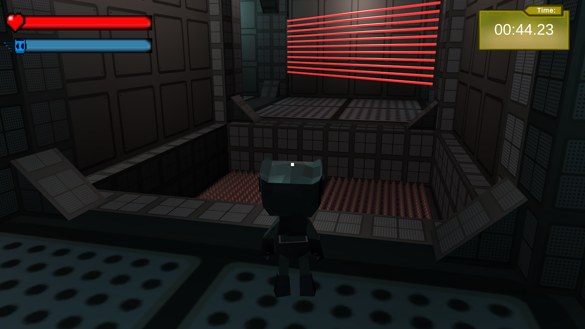

# COMP2007-Game

This repository is for my Comp2007 assessment 2 Game in unity, named Robot Labyrinth. It contains the windows executable to run the game and the unity files necessary.

The goal of the game is to run through a randomly generated maze while avoiding traps in order to get the fastest competion time.

## Itch.io Page
[Link to my Itch.io page for this game](https://compressedsand.itch.io/robot-labyrinth)

## Controls

**Movement -** W, A, S and D

**Jump -** Space

**Dash -** E

**Crouch -** Shift

**Sprint -** Left Ctrl

**Interaction -** Right Click

### Installation

Download the "Final Game" folder inside this repository. This will contrain a Robot Labyrinth.exe file and other necessary files needed to run the game.

Alternatively goto the itch.io page and download from there.

## Screenshots

## Acknowledgements
#### Used Sound Effects Assets

- [Door, Cabinets & Lockers](https://assetstore.unity.com/packages/audio/sound-fx/foley/door-cabinets-lockers-free-257610)

- [Dynamic Music](https://assetstore.unity.com/packages/audio/music/dynamic-music-35925)

- [Footsteps - Essentials](https://assetstore.unity.com/packages/audio/sound-fx/foley/footsteps-essentials-189879)

- [Free Sound Effects Pack](https://assetstore.unity.com/packages/audio/sound-fx/free-sound-effects-pack-155776)

- [Space Ambient Album - 101218](https://assetstore.unity.com/packages/audio/ambient/space-ambient-album-101218-130708)

- [UI SFX Free Pack](https://assetstore.unity.com/packages/audio/sound-fx/ui-sfx-free-pack-245925)

- [Adventure Music and SFX](https://assetstore.unity.com/packages/audio/music/adventure-music-and-sfx-221545)

